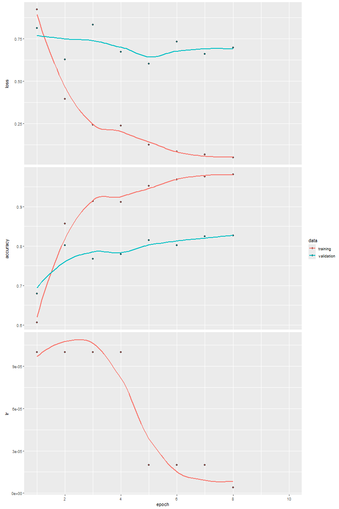

#  Classification Project
This project uses a convolutional neural network (CNN) in R with Keras and TensorFlow to classify brain tumor images. The dataset includes images categorized into types like glioma, meningioma, pituitary, and notumor. Images are standardized to 128x128 pixels with RGB channels. Augmentation techniques enhance model robustness during training. K-fold cross-validation ensures the model generalizes well. Transfer learning with VGG16 leverages pretrained features. The model's accuracy is optimized with early stopping and learning rate adjustments, and the best-performing model is saved for deployment, aiming to improve brain tumor classification accuracy.
# How it works ?
- Environment Setup:Essential libraries such as TensorFlow, Keras, and others are loaded in R.
The Python path is configured to integrate TensorFlow functionalities seamlessly.
- Data Preparation:Brain tumor images are sourced from specific directories for training and validation.
Images undergo preprocessing, including rescaling and augmentation using Keras' image_data_generator and flow_images_from_directory functions.
Augmentation techniques like rotation, shifting, zooming, and flipping are applied to enhance model robustness.
- Model Architecture:The CNN model is structured with:
Convolutional layers for feature extraction.
Activation functions (e.g., ReLU) to introduce non-linearity.
Batch normalization for stable learning.
Max pooling for spatial downsampling.
Dropout layers to prevent overfitting.
A dense output layer with softmax activation for multi-class classification.
- Cross-validation Training:Implements k-fold cross-validation to ensure:
The model's reliability and generalizability across different data subsets.
Validation sets are rotated to validate model performance iteratively.
Model Evaluation:

- Validation accuracy is monitored across folds to:
Assess model performance.
Optimize hyperparameters and prevent overfitting.
# Libraries Used
`TensorFlow` is an open-source library for machine learning and numerical computation.
```r
install.packages("tensorflow")

library(tensorflow)
```
`Keras` is a high-level API for building deep learning models.
```r
install.packages("keras")

library(keras)
```
`Caret` is a package for building machine learning models.
```bash
install.packages("caret")

library(caret)
```
`Tidyverse` is a collection of packages for data manipulation and visualization.
```r
install.packages("tidyverse")

library(tidyverse)
```
These installation instructions should be sufficient for you to set up your environment and run your project.
# CNN classification 
Here, this section defines a `CNN model` using transfer learning from VGG16, incorporating feature extraction, dropout regularization, and softmax activation for classification. The model is configured with categorical cross-entropy loss and Adam optimizer, trained over 10 epochs with validation data included.

```r
# Define and compile the model using transfer learning
base_model <- application_vgg16(weights = 'imagenet', include_top = FALSE, input_shape = c(img_width, img_height, channels))

model <- keras_model_sequential() %>%
  base_model %>%
  layer_flatten() %>%
  layer_dense(units = 512, activation = "relu") %>%
  layer_dropout(rate = 0.5) %>%
  layer_dense(units = output_n, activation = "softmax")

model %>% compile(
  loss = "categorical_crossentropy",
  optimizer = optimizer_adam(learning_rate = 0.0001),
  metrics = "accuracy"
)

# Training the model
history <- model %>% fit(
  x = train_image_array_gen,
  epochs = 10,  # Keeping epochs at 10 to save time
  validation_data = valid_image_array_gen,
  callbacks = list(
    callback_early_stopping(monitor = "val_loss", patience = 3),
    callback_reduce_lr_on_plateau(monitor = "val_loss", factor = 0.2, patience = 2)
  )
)

```
#### Model Evaluation
The plot visualizes the model's performance over epochs, showing a high training accuracy of 0.9739 and low validation loss of 0.0998. This indicates effective learning and good generalization capability.


# Lime Interpretation 
`LIME` (Local Interpretable Model-agnostic Explanations)is a powerful technique for providing local interpretability to machine learning models. It helps to explain individual predictions by highlighting the most influential features.

```r
# Define a custom model class
CustomModel <- R6::R6Class(
  "CustomModel",
  public = list(
    predict = function(paths) {
      images <- lapply(paths, preprocess)
      images_array <- abind::abind(images, along = 1)
      preds <- predict(model, images_array)
      return(as.data.frame(preds))
    }
  )
)

# Create an instance of the custom model
custom_model <- CustomModel$new()

# Define a function to preprocess images
preprocess <- function(path) {
  img <- image_load(path, target_size = c(128, 128))
  img <- image_to_array(img)
  img <- array_reshape(img, c(1, 128, 128, 3))
  img <- img / 255
  return(img)
}

# Load the trained model
model <- load_model_hdf5("www/my_model.h5")

# Prepare image paths for explanation
image_paths <- list.files(train_image_files_path, pattern = "*.jpg", full.names = TRUE, recursive = TRUE)
sampled_image_paths <- sample(image_paths, 50)  # Sample 50 images for explanation

# Create an explainer using LIME
explainer <- lime::lime(
  x = sampled_image_paths,
  model = custom_model
)

# Choose an image for explanation
image_path <- "D:/PFE_References/Brain_Tumor/Training/meningioma/Tr-me_0022.jpg"

# Generate explanations with LIME
explanation <- lime::explain(
  x = image_path,
  explainer = explainer,
  n_labels = 1, 
  n_features = 5
)

# Visualize the explanation
plot_features(explanation)

```
This snippet demonstrates the setup and utilization of Lime to explain model predictions using a custom model.
# References
- [1] Aldughayfiq, Bader, et al. "Explainable AI for retinoblastoma diagnosis: interpreting deep learning models with LIME and SHAP." Diagnostics 13.11 (2023)
- [2] Gill, Harmandeep Singh, and Baljit Singh Khehra. "Fruit image classification using deep learning." (2022).
- [3] https://shirinsplayground.netlify.app/2020/09/keras_fruits_update/
- [4] https://shirinsplayground.netlify.app/2018/06/keras_fruits_lime/
- [5] https://www.kaggle.com/datasets/masoudnickparvar/brain-tumor-mri-dataset
- [6] https://www.researchgate.net/publication/338077321_Brain_Tumor_Classification_Using_Convolutional_Neural_Network

"# Test_app" 
